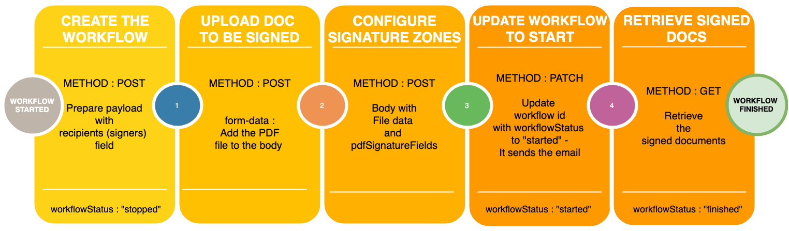
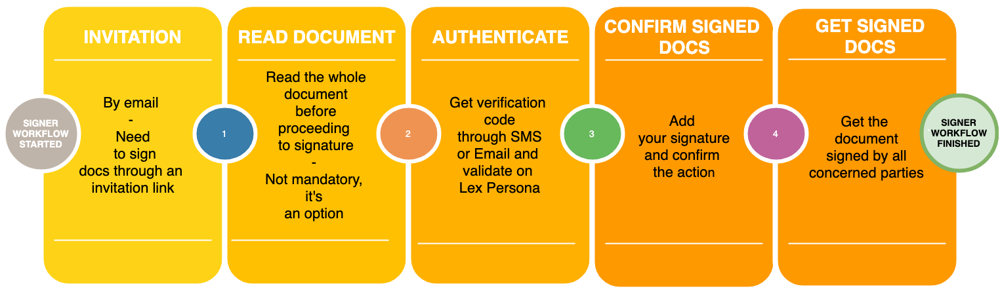

This is the documentation on how to implement Lex Persona Workflow Manager, an electronic signature provider.
## First steps : What is Lex Persona ?
Lex Persona is a web service that provides you with the possibility to create electronic signature workflows.

The workflow manager is a product from the Lex Persona Enterprise, it helps many public and private companies in the domain of signing a document (or many) by an authenticated user (or many).

The aim of their development, is to provide a safe and secured place where the Business Application can rely on the Workflow Manager in order to engage the procedure that implies :

- Create of a workflow with the user(s) that is/are concerned.
- Add the user(s) to whom we will send the document(s) to sign.
- Upload of the document to sign that we will add to the created workflow.
- Set the different zonings where the signature should be placed at.
- Start the workflow procedure (send the email which notifies the user that he has some document(s) to be signed through Lex Persona).
- Lex Persona handles the authentication and it verifies the user through email or SMS code validation. Once authenticated, the user may sign the document.
- Retrieve the "finished" `workflowStatus` of a workflow object.
- Retrieve at the end the documents that were signed by all the implied parties (we may implement it through a webhook to check if the `workflowStatus` is "finished" OR just by polling the data with a cron job every night).

In a few words, Lex Personna hosts and orchestrates signature and approbation workflow. It also makes sure that the signature is AdES compliant (stands for Advanced Electronic Signature).

The **goal** is to : **create** a workflow (with the concerned users), **upload** the documents to be signed in the workflow, and **retrieve** the documents once the workflow has **finished**.

## How to make sure the person concerned is signing the document ?
The biggest challenge with signing documents online, is to make sure that the person who signs is actually the person that we aim for. The Workflow Manager of Lex Persona allows us the choose which way of authentication we want to apply to our business application and needs.

Here is part of the following ways to accomplish this :

- Email validation code
- SMS validation code
- France Connect ( French administration hub )

## Do we have to create an account for each signers ?
When we create a workflow, the API offers us a way to send directly to the email address of a person without the need to create a user for this particular task in Lex Persona Platform.

If you have chosen to use the SMS validation for example, it will be required that you have the telephone number of the future signer in advance. Else, if we do the validation through email, we will need to provide the user's email address (among with his `firstName` and `lastName`) inside the payload of the request (more examples further down). The fields `firstName` or `lastName` can not be blank or null.

For an external contact, is the same concept of inviting someone from outside our environment to join and sign the documents through Lex Persona. It is possible. In this case, we shall provide the workflow with all the required data depending on the validation step we set up.

In the case of Joanie, it is possible that the **users** that we will **create** inside with the Workflow Manager of Lex Persona will be the academic tutors (or the academic representatives), and the students can be Contacts or external contacts only.

## How long can a document be archived by Lex Persona ?
Lex Persona can keep the document in their archives from 6 up to 10 years. We also have the possibility to retrieve a signed document from 6 up to 10 years as well. The document signed has an hash signature that certifies that the document was not altered since the signature took place.


## API Tutorial - Workflow Manager
As we have mentioned in the first section of this document, there are a few API calls (5) to execute in order to launch the workflow and get back the document fully signed.

### REQUIREMENT
You **MUST** have a **Bearer Token**, that is kept into the .env file (or else where depending on your setup) of your project. This key **MUST** remain secret.

Once we will have implemented our LexPersona gateway, we will update this part to mention which environment variable the developer should set for this purpose.

### SCHEMA
1. Structured data are sent and received as JSON
2. All timestamps are returned in milliseconds since January 1, 1970.

___

### Here are the main steps :


To summarize the main steps with the API :

- Create the workflow (POST method)
- Upload the document to be signed (POST method)
- Configure the signature zones (POST method)
- Update the `workflowStatus` of the workflow that we have just created to "started" (PATCH method)
- Retrieve the signed documents (GET method)

Additionnaly, you can create the invitation link with a POST request in order to have the control on how we will deliver this link to our future signer. This implies to set the `maxInvites` to 0 when we create the workflow in the payload, which gives us the control for the invitation link overtime (more details further down the documentation).
___
### I) Check our user's data
#### 1- Check my user data
**Endpoint** : /api/users/me

**Method** : GET

**Headers** :
- Authorization : Bearer {{token}}

**Response** :
```json
{
    "approveAllowed": true,
    "country": "FR",
    "created": 1683813965411,
    "email": "johndoe@example.com",
    "firstName": "John",
    "groupId": "grp_9woWtcSt5KiAzyqL********",
    "id": "usr_P5YBCEeRqY8jKGGM********",
    "isDisabled": false,
    "lastLogin": 1683814013765,
    "lastName": "Doe",
    "name": "John Doe",
    "organizationTitles": [],
    "phoneNumber": "+33 * ** ** ** **",
    "signAllowed": true,
    "tenantId": "ten_9H4TvNNQFfrLBXH22P2k****",
    "updated": 1683814013765,
    "viewAuthorizedGroups": [
        "grp_9woWtcSt5KiAzyqLE5Xf****"
    ]
}
```
#### 2-Create a User who has to sign a document
**Endpoint** : /api/tenants/{{tenant_id}}/users

**Method** : POST

**Headers** :
- Authorization : Bearer {{token}}
- Content-Type : application/json

**Body Type** : JSON

**Payload** :
```json
{
  "groupId" : "grp_9woWtcSt5KiAzyq********",
  "isDisabled" : false,
  "email" : "johndoe@example.com",
  "firstName" : "John",
  "lastName" : "Doe",
  "phoneNumber": "+33 * ** ** ** **",
  "country" : "FR",
  "organizationTitles" : []
}
```

**Response** :
```json
{
    "approveAllowed": true,
    "country": "FR",
    "created": 1688993042392,
    "email": "johndoe@example.com",
    "firstName": "John",
    "groupId": "grp_9woWtcSt5KiAzyq********",
    "id": "usr_H5RSBaPTeYu7Ejs********",
    "isDisabled": false,
    "lastLogin": 0,
    "lastName": "Doe",
    "name": "John Doe",
    "organizationTitles": [],
    "phoneNumber": "",
    "signAllowed": true,
    "tenantId": "ten_9H4TvNNQFfrLBXH********",
    "updated": 1688993042392,
    "viewAuthorizedGroups": [
        "grp_9woWtcSt5KiAzyq********"
    ]
}
```
If you use the Token that was provided by Lex Persona testing, we will need to authenticate the user with his phone Number.
___
### II) Workflow
#### 1- Create the workflow
**Endpoint** :  /api/users/{{our_user_id}}/workflows

**Method** : POST

**Body Type** : JSON

**Headers** :
- Authorization : Bearer {{token}}
- Content-Type : application/json

**Payload** :
```json
{
  "name" : "Aerodynamic Silk Bottle",
  "description" : "1 rue de l'exemple, 75000 Paris",
  "steps" : [ {
    "stepType" : "signature",
    "recipients" : [ {
      "consentPageId" : "cop_NzBEGbgTkj7v5************",
      "email" : "johndoe@example.com",
      "country" : "FR",
      "phoneNumber":"+33 * ** ** ** **",
      "preferredLocale" : "fr",
      "firstName":"John",
      "lastName":"Doe"
    } ],
    "requiredRecipients" : 1,
    "validityPeriod" : 8553600000,
    "invitePeriod" : 86400000,
    "maxInvites" : 5,
    "sendDownloadLink" : true,
    "allowComments" : true,
    "hideAttachments" : false,
    "hideWorkflowRecipients" : true
  } ],
  "notifiedEvents" : [ "recipientRefused", "recipientFinished", "workflowStopped", "workflowFinished" ],
  "watchers" : []
}
```
**Response** :

```json
{
    "created": 1688993660520,
    "currentRecipientEmails": [],
    "currentRecipientUsers": [],
    "description": "1 rue de l'exemple, 75000 Paris",
    "email": "johndoe@example.com",
    "firstName": "John",
    "groupId": "grp_9woWtcSt5KiAzyq************",
    "id": "wfl_4yzLat7tDUQ8Jw************",
    "lastName": "Doe",
    "logs": [],
    "name": "Aerodynamic Silk Bottle",
    "notifiedEvents": [
        "recipientRefused",
        "recipientFinished",
        "workflowStopped",
        "workflowFinished"
    ],
    "progress": 0,
    "steps": [
        {
            "allowComments": true,
            "hideAttachments": false,
            "hideWorkflowRecipients": true,
            "id": "stp_D5KgBHk63MkhdGw********",
            "invitePeriod": 86400000,
            "isFinished": false,
            "isStarted": false,
            "logs": [],
            "maxInvites": 5,
            "recipients": [
                {
                    "consentPageId": "cop_NzBEGbgTkj7v5tq********",
                    "country": "FR",
                    "email": "johndoe@example.com",
                    "firstName": "John",
                    "lastName": "Doe",
                    "phoneNumber": "+33 * ** ** ** **",
                    "preferredLocale": "fr"
                }
            ],
            "requiredRecipients": 1,
            "sendDownloadLink": true,
            "stepType": "signature",
            "validityPeriod": 8553600000
        }
    ],
    "tenantId": "ten_9H4TvNNQFfrLBXH********",
    "updated": 1688993660520,
    "userId": "usr_P5YBCEeRqY8jKGG********",
    "viewAuthorizedGroups": [
        "grp_9woWtcSt5KiAzyq********"
    ],
    "viewAuthorizedUsers": [],
    "watchers": [],
    "workflowStatus": "stopped"
}
```
Once this is done, you have just created the workflow, well done !

In this example, I've decided to send the document to be signed to a user that is not yet registered on the Lex Persona BackOffice. Let's dive into more details **when the signer is an external contact in LexPersona :**

It is required to send in the request's payload the `firstName` and the `lastName` of the signer if it is an external contact. If one of those fields is missing, the API responds with a Bad request - 400 : "A recipient in the request is missing identity information." It also responds with a Bad request if the `email` is missing.

If we do not provide a `userId`, the required data of a contact would be the following ones:
- With SMS validation : `firstName`, `lastName`, `email`, `phoneNumber`

- Without SMS validation : `phoneNumber` is not required.

Today, with Joanie, since we have a `full_name` that provides the `firstName` and the `lastName` altogether, we will insert the `full_name` into the `firstName` field and we will add the character "." into the `lastName` field.

For example, if our user is named : "John Doe", we can prepare the `recipients` the following way :
```json
"recipients" : [ {
    "consentPageId" : "cop_NzBEGbgTkj7v5tq********",
    "email" : "johndoe@example.com",
    "country" : "FR",
    "lastName": ".",
    "firstName": "John Doe",
    "phoneNumber": "+33 * ** ** ** **",
    "preferredLocale" : "fr"
} ],
```
Finally, the example above shows you that it is not required to create a "user". We can just parse the signer's details into the "recipients" list of the payload (`firstName`, `lastName`, `phoneNumber`, `email`).

If you try to add the contact's information with the field `name` (it's a full name) instead of the `firstName` and the `lastName` fields such as :
```json
"recipients" : [ {
      "consentPageId" : "cop_NzBEGbgTkj7v5tqp********",
      "email" : "jonathan.reveille@fun-mooc.fr",
      "country" : "FR",
      "name": "John Doe",
      "phoneNumber": "+33 * ** ** ** **",
      "preferredLocale" : "fr"
    } ],
```
The API will response with a : 400 - Bad Request with the message :
```json
"message": "A recipient in the request is missing identity information.",
```

In contrary, if we have already created the user, we can just add the `userId` key and value into the request payload, such as :
```json
    "recipients" : [ {
      "consentPageId" : "cop_NzBEGbgTkj7v5tqp********",
      "country" : "FR",
      "userId": "usr_H5RSBaPTeYu7EjsG********",
      "preferredLocale" : "fr"
    } ],
```
The API will retrieve the data of the `userId` to use in order to send out the document through Lex Persona.

When we receive the response of our POST request to create the workflow, we can see that the `workflowStatus` as the value **"stopped"**. Which indicates that we will need in another request to **start** the **workflow** process.

```json
"workflowStatus": "stopped"
```
But first, we **must** add (upload) the document to be signed in the workflow that has been just created.
___
#### 2 - Uploading the document to be signed
**Endpoint** : api/workflows/{{workflow_id_created}}/parts?createDocuments=true&signatureProfileId={{signature_profile}}

**Method** : POST

**Headers**:
- Authorization : Bearer {{token}}
- Content-Type : multipart/form-data

**Params** :
- key: createDocument,
value: true
- key:  signatureProfileId,
value: sip_…

**Body Type** : form-data
- key: file1, value: le_fichier_pdf_a_soumettre.pdf

**Response** :
```json
{
    "documents": [
        {
            "created": 1688994064535,
            "groupId": "grp_9woWtcSt5KiAzyq********",
            "id": "doc_JyjUX6uyzFBcjTx********",
            "parts": [
                {
                    "contentType": "application/pdf",
                    "filename": "the_file_to_sign.pdf",
                    "hash": "t4Vjd+1/T6tR4YBoLNcjryUiJLaaoMBXydBCIiOX928=",
                    "size": 83012
                }
            ],
            "pdfSignatureFields": [],
            "signatureProfileId": "sip_88QapTygDpiwNsq********",
            "tenantId": "ten_9H4TvNNQFfrLBXH********",
            "updated": 1688994064535,
            "userId": "usr_P5YBCEeRqY8jKGG********",
            "viewAuthorizedGroups": [
                "grp_9woWtcSt5KiAzyq********"
            ],
            "viewAuthorizedUsers": [],
            "workflowId": "wfl_4yzLat7tDUQ8JwF********",
            "workflowName": "Aerodynamic Silk Bottle"
        }
    ],
    "ignoredAttachments": 0,
    "parts": [
        {
            "contentType": "application/pdf",
            "filename": "the_file_to_sign.pdf",
            "hash": "t4Vjd+1/T6tR4YBoLNcjryUiJLaaoMBXydBCIiOX928=",
            "size": 83012
        }
    ]
}
```

**How can we assert that the document is immutable once it has been uploaded and signed ?**

**A) Creation of the document's hash** :

The document we have uploaded to our workflow object passes through a cryptographic hash function. This function takes the content of the document and converts it in a sequence of alphanumeric characters called "hash" or "fingerprint". Whatever the document size is, the "hash" will always have the same length.

**B) Hash signature** :

Once the document's hash has been created, it is signed using the private key of a pair of cryptographic keys (public key / private key). The private key is owned only by the person signing the document, while the public key can be shared with other users.

**C) Add the signature to the document** :

The resulting signature (which is essentially a string of bits) is added to the original document, creating the electronically signed version.

**D) Signature verification** :

If someone wishes to check the validity of the document, the process goes the other way around, which means : the signer extracts the signed document's hash and he uses the public key in order to verify if the hash's signature is valid.

If the verification succeeds, it means that the document was not altered (changed) and the signature was performed by a person holding the private key corresponding to the public key used for verification.

Globally, the verification of signature's hash can be made easily through Adode product.
___

#### 3- Set the zones for the signature of a document

This part requires that we evaluate where the signature will appear on every document that the business application will generate. If we have a clear template, we can then find out what is the position that a signature should appear. Here is how to tell Lex Persona, where to sign the uploaded document that is attached to the workflow :

Take this part from the response after uploading the document to the workflow :
```json
    "parts": [
        {
            "contentType": "application/pdf",
            "filename": "the_file_to_sign.pdf",
            "hash": "t4Vjd+1/T6tR4YBoLNcjryUiJLaaoMBXydBCIiOX928=",
            "size": 83012
        }
    ],
```
Then prepare your payload,

**Endpoint** : /api/workflows/{{workflow_id_created}}/documents

**Method** : POST

**Headers** :
- Content-Type : application/json

**Body Type** : JSON

**Payload** :
```json
{
    "parts": [
        {
            "contentType": "application/pdf",
            "filename": "the_file_to_sign.pdf",
            "hash": "t4Vjd+1/T6tR4YBoLNcjryUiJLaaoMBXydBCIiOX928=",
            "size": 83012
        }
    ],
    "signatureProfileId": "sip_88QapTygDpiwNsqt********",
    "pdfSignatureFields": [
        {
            "imagePage": -1,
            "imageX": 390.0,
            "imageY": 710.0,
            "imageWidth": 150.0,
            "imageHeight": 80.0
        }
    ]
}
```
The section "pdfSignatureFields" : this part allows us to tell where the signature should occur for the signer.

Here is more data about each keys :
- `imagePage` : the page where the signature should appear. The value -1 means that it is the last page of a document for example. The value -2 will be the before last page. If you want to set the page to the first page, you should put the value 1.
- `imageX` : position in pixel width.
- `imageY` : position in pixel height.
- `imageWidth` : length of the rectangle zone.
- `imageHeight` : height of the rectangle zone.

If you want to add more zones, you can add them in the payload above for example into the key "pdfSignatureFields":
```json
    "pdfSignatureFields": [
        {
            "imagePage": -1,
            "imageX": 390.0,
            "imageY": 710.0,
            "imageWidth": 150.0,
            "imageHeight": 80.0
        },
        {
            "imagePage": -1,
            "imageX": 180.0,
            "imageY": 355.0,
            "imageWidth": 150.0,
            "imageHeight": 80.0
        }
    ]
```
___
#### 4- Launch the workflow process

**Endpoint** : api/workflows/{{workflow_id_created}}/

**Method** : PATCH

**Headers**:
- Authorization : Bearer {{token}}
- Content-Type : application/json

**Body Type** :  JSON

**Payload** :
```json
{
    "workflowStatus": "started"
}
```
**Response** :
```json
{
    "created": 1688993660520,
    "currentRecipientEmails": [
        "johndoe@example.com"
    ],
    "currentRecipientUsers": [],
    "description": "1 rue de l'exemple, 75000 Paris",
    "email": "johndoe@example.com",
    "firstName": "John",
    "groupId": "grp_9woWtcSt5KiAzyq********",
    "id": "wfl_4yzLat7tDUQ8JwF********",
    "jobOperation": "processWorkflow",
    "lastName": "Doe",
    "logs": [],
    "name": "Aerodynamic Silk Bottle",
    "notifiedEvents": [
        "recipientRefused",
        "recipientFinished",
        "workflowStopped",
        "workflowFinished"
    ],
    "progress": 0,
    "started": 1688994896088,
    "steps": [
        {
            "allowComments": true,
            "hideAttachments": false,
            "hideWorkflowRecipients": true,
            "id": "stp_D5KgBHk63MkhdGw********",
            "invitePeriod": 86400000,
            "isFinished": false,
            "isStarted": true,
            "logs": [
                {
                    "created": 1688994896088,
                    "operation": "start"
                }
            ],
            "maxInvites": 5,
            "recipients": [
                {
                    "consentPageId": "cop_NzBEGbgTkj7v5tq********",
                    "country": "FR",
                    "email": "johdoe@example.com",
                    "firstName": "John",
                    "lastName": "Doe",
                    "phoneNumber": "+33 * ** ** ** **",
                    "preferredLocale": "fr"
                }
            ],
            "requiredRecipients": 1,
            "sendDownloadLink": true,
            "stepType": "signature",
            "validityPeriod": 8553600000
        }
    ],
    "tenantId": "ten_9H4TvNNQFfrLBXH********",
    "updated": 1688994896088,
    "userId": "usr_P5YBCEeRqY8jKGG********",
    "viewAuthorizedGroups": [
        "grp_9woWtcSt5KiAzyq********"
    ],
    "viewAuthorizedUsers": [],
    "watchers": [],
    "workflowStatus": "started"
}
```
We can observe that the `workflowStatus` value is set to "started" and the "progress" is set to 0.

At this point, recipients will receive through email or SMS a notification that a document requires to be signed by them.
___

### III) Signing the document (user's view on his browser)
#### 1.1- The signer side


To summarize the main steps from the signer's point of view :
- The signer will receive an email with an invitation link to sign documents that he is concerned about OR he will be asked to click on the invitation link that we have create within our Business Applcation to sign documents.
- Once the signer has clicked on the invitation link, he will be redirected to the document page where he will need to read entirely the document in order to unlock the next step which is the signature.
- Before the signature takes part, the signer is invited to validate that he is about to sign the document that he has just read. He will need to authenticate through an Email code validation or a SMS code validation. When this step is done, he will finally be allowed to sign the document.
- The signer will receive its copy of the signed document once all concerned parties have signed on it.

At the end of this step, meaning that the user has signed the document, we will receive
an email notification suggesting the signers to download the freshly signed documents.
___
#### 1.2- An alternative way to get the invitation link and use it in our Business Application
If you prefer to **send invitation link from your business application**, you can prevent the Workflow Manager from sending the invitations through email by setting the step field `maxInvites` to 0 and you can use the workflow API to create the invite link programmatically for each recipient. For example, if you want to create a workflow where you handle the invitation link, your payload to create a workflow should be :

**Endpoint** :  /api/users/{{our_user_id}}/workflows

**Method** : POST

**Body Type** : JSON

**Headers** :
- Authorization : Bearer {{token}}
- Content-Type : application/json

**Payload** :
```json
{
  "name" : "Aerodynamic Silk Bottle",
  "description" : "1 rue de l'exemple, 75000 Paris",
  "steps" : [ {
    "stepType" : "signature",
    "recipients" : [ {
      "consentPageId" : "cop_NzBEGbgTkj7v5************",
      "email" : "johndoe@example.com",
      "country" : "FR",
      "phoneNumber":"+33 * ** ** ** **",
      "preferredLocale" : "fr",
      "firstName":"John",
      "lastName":"Doe"
    } ],
    "requiredRecipients" : 1,
    "validityPeriod" : 8553600000,
    "invitePeriod" : 86400000,
    "maxInvites" : 0, // this line
    "sendDownloadLink" : true,
    "allowComments" : true,
    "hideAttachments" : false,
    "hideWorkflowRecipients" : true
  } ],
  "notifiedEvents" : [ "recipientRefused", "recipientFinished", "workflowStopped", "workflowFinished" ],
  "watchers" : []
}
```
**Once we have set our `maxInvites` to 0, we can now create the invitation link :**

**Endpoint** : /api/workflows/{{workflow_id_created}}/invite

**Method** : POST

**Payload** :
```json
{
  "recipientEmail" : "johndoe@example.com"
}
```
**Response** :
```json
{
  "inviteUrl" : "https://example.com/invite?token=JWT_TOKEN..."
}
```
____
#### 2- Retrieve the status of the workflow
Once those steps through the user are finished, we can now check our `workflowStatus` :

**Endpoint** : /api/workflows/{{workflow_id_created}}

**Method** : GET

**Response** :
```json
{
    "created": 1689089045598,
    "currentRecipientEmails": [],
    "currentRecipientUsers": [],
    "description": "1 rue de l'exemple, 75000 Paris",
    "email": "johndoe@example.com",
    "firstName": "John",
    "groupId": "grp_9woWtcSt5KiAzyq********",
    "id": "wfl_A1pRnmnXfW2G2akS********",
    "lastName": "Doe",
    "logs": [],
    "name": "Aerodynamic Silk Bottle",
    "notifiedEvents": [
        "recipientRefused",
        "recipientFinished",
        "workflowStopped",
        "workflowFinished"
    ],
    "progress": 100,
    "started": 1689092760018,
    "steps": [
        {
            "allowComments": true,
            "hideAttachments": false,
            "hideWorkflowRecipients": true,
            "id": "stp_x6WLNow6GqDRsr2k********",
            "invitePeriod": 86400000,
            "isFinished": true,
            "isStarted": true,
            "logs": [
                {
                    "created": 1689092760018,
                    "operation": "start"
                },
                {
                    "created": 1689092760018,
                    "operation": "notifyWorkflowStarted"
                },
                {
                    "created": 1689092760372,
                    "operation": "invite",
                    "recipientEmail": "johndoe@example.com",
                    "recipientUserId": "usr_H5RSBaPTeYu7EjsG****"
                },
                {
                    "created": 1689092977709,
                    "evidenceId": "evi_serversealing_m408RqHSvAIOAaP2********",
                    "operation": "sign",
                    "recipientEmail": "johndoe@example.com",
                    "recipientUserId": "usr_H5RSBaPTeYu7EjsG****"
                },
                {
                    "created": 1689092977709,
                    "operation": "notifyRecipientFinished",
                    "recipientEmail": "johndoe@example.com",
                    "recipientUserId": "usr_H5RSBaPTeYu7EjsG********"
                },
                {
                    "created": 1689092977709,
                    "operation": "notifyWorkflowFinished"
                }
            ],
            "maxInvites": 5,
            "recipients": [
                {
                    "consentPageId": "cop_NzBEGbgTkj7v5tqp****",
                    "country": "FR",
                    "email": "johndoe@example.com",
                    "firstName": "John",
                    "lastName": "Doe",
                    "phoneNumber": "+33 * ** ** ** **",
                    "preferredLocale": "fr",
                    "userId": "usr_H5RSBaPTeYu7********"
                }
            ],
            "requiredRecipients": 1,
            "sendDownloadLink": true,
            "stepType": "signature",
            "validityPeriod": 8553600000
        }
    ],
    "tenantId": "ten_9H4TvNNQFfrLBXH2********",
    "updated": 1689092977939,
    "userId": "usr_P5YBCEeRqY8jKGGM********",
    "viewAuthorizedGroups": [
        "grp_9woWtcSt5KiAzyqL********"
    ],
    "viewAuthorizedUsers": [
        "usr_H5RSBaPTeYu7EjsG********"
    ],
    "watchers": [],
    "workflowStatus": "finished"
}
```
We can see the `workflowStatus` has reached its final step : "finished"
___
#### 3- Retrieve the signed documents :
For a normal signer who was invited to sign a document, he will be able to retrieve the documents through the last notification email that states the end of the worklfow.

Concerning the API, we can just use the API to retrieve the documents that were signed.

**Endpoint** : /api/workflows/{{workflow_id_created}}/downloadDocuments

**Method** : GET

**Response** : signed_document.pdf

We receive the raw version of the PDF signed document.
