# Setup Moodle backend

In order to use Moodle as an LMS backend in Joanie,
we need to set up a Moodle webservice, and a Moodle webservice client.

## Setup Moodle webservice

### Create a Joanie user

1. In the Moodle admin panel, go to `Site administration > Users > Accounts > Add a new user`.

    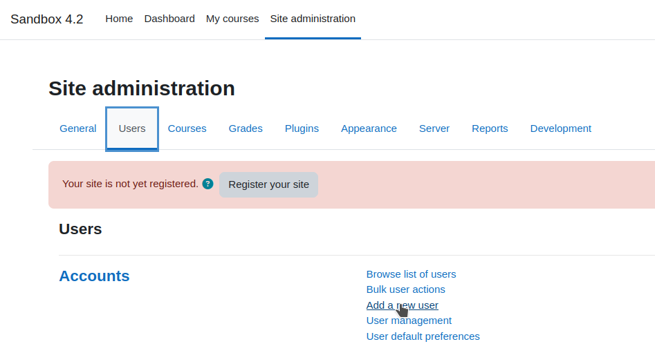

2. Fill the form with the following values:

   - Username: `joanie`
   - Password: `xxxxxxxx`
   - First name: `joanie`
   - Last name: `joanie`
   - Email address: `joanie@example.com`

   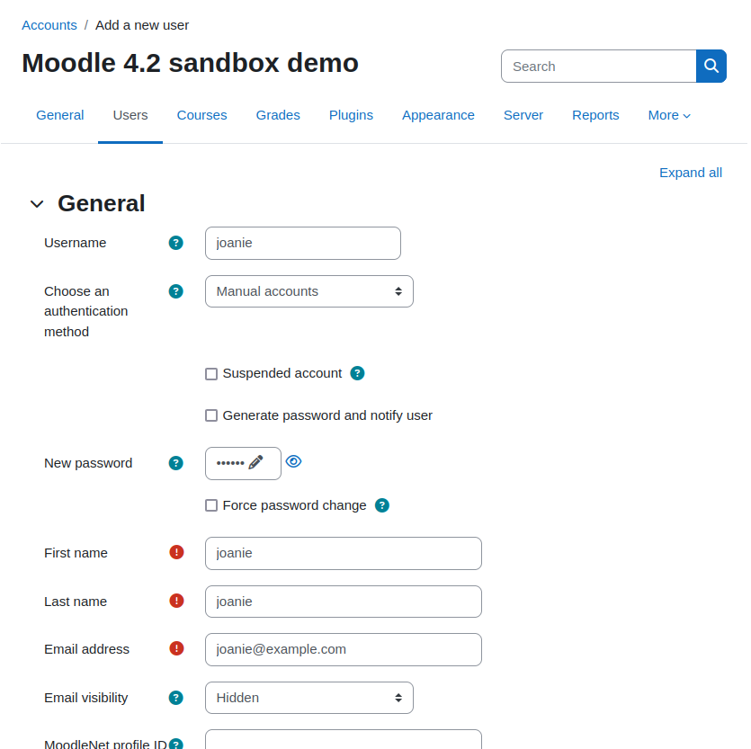

3. Click on the **Create user** button.

### Assign manager role to Joanie user

1. In the Moodle admin panel, go to `Site administration > Users > Permissions > Assign system roles`.

    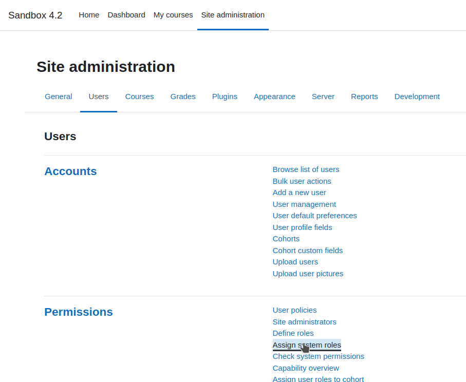

2. Click on the existing **Manager** role.

    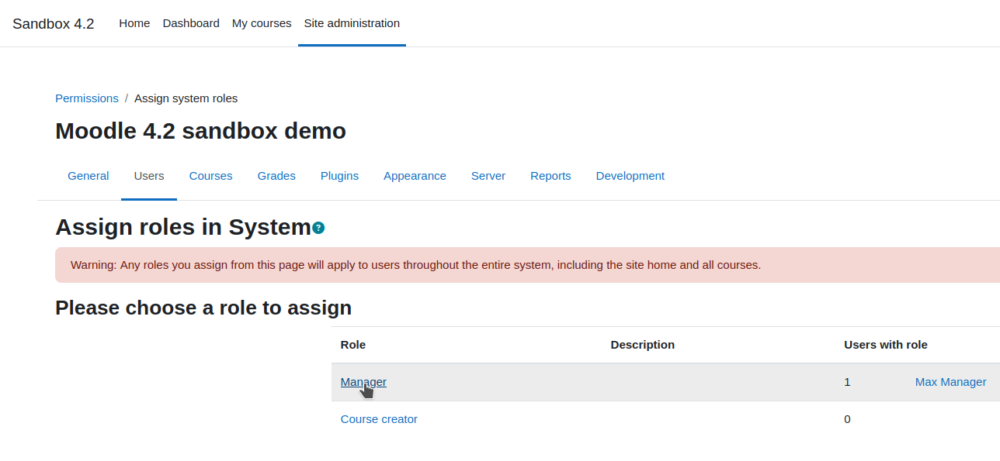

3. In the **Potential users** list, select the **joanie** user, and click on the **Add** button.

    

### Create a Joanie webservice

[Detailed Moodle configuration documentation](https://docs.moodle.org/402/en/Using_web_services)


1. In the Moodle admin panel, go to `Site administration > Server > Web services > External services`.

    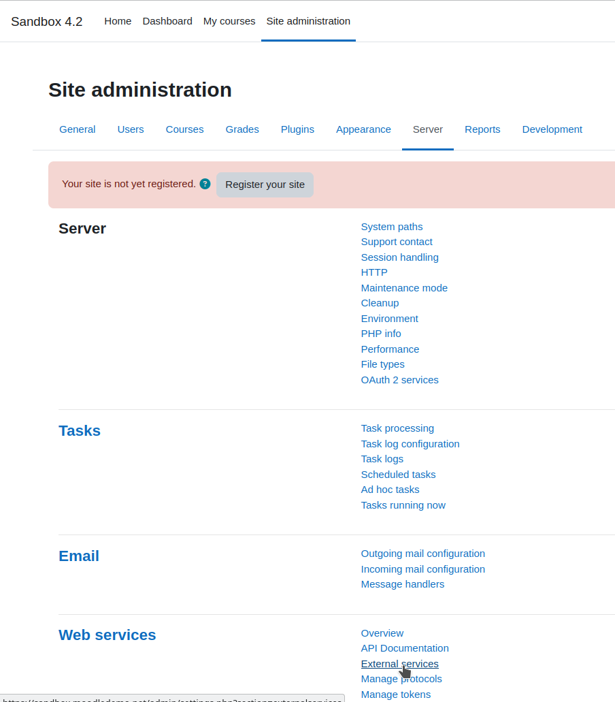

2. Click on the **Add** button.
 
    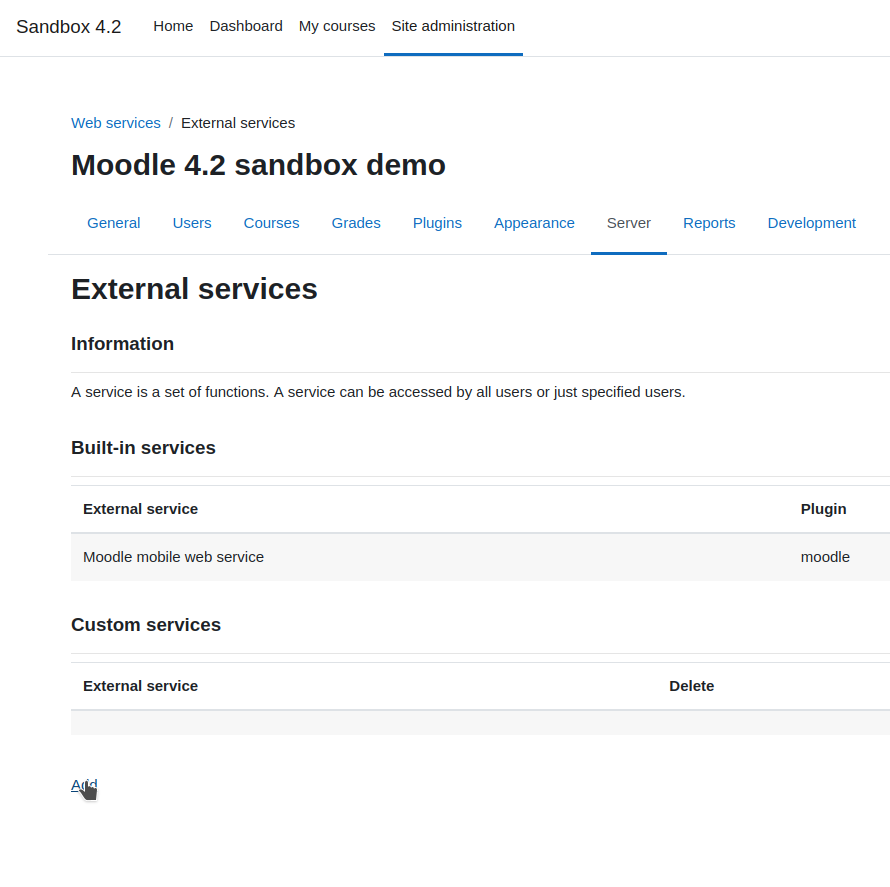

3. Fill the form with the following values:

   - Name: `Joanie`
   - Shortname: `joanie`
   - Enabled: `checked`
   - Authorized users only: `checked`

    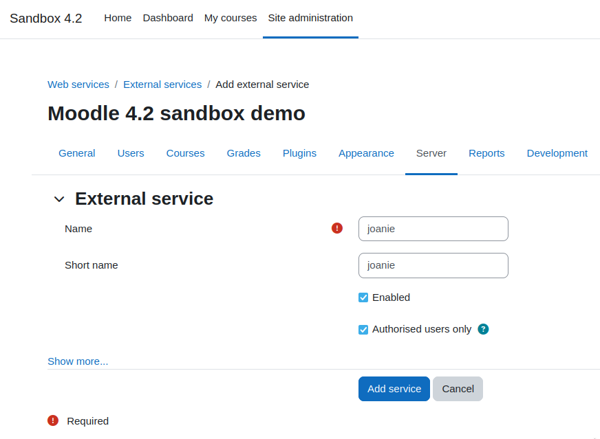

4. Click on the **Add service** button.

5. Click on the **Add functions** button.

    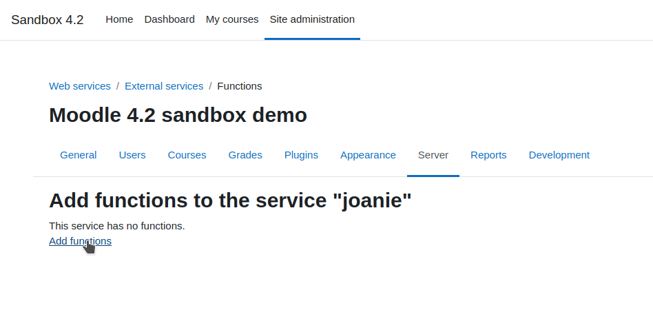

6. For each function below, search for it in the dropdown select, and click it.

   - core_completion_get_course_completion_status
   - core_enrol_get_enrolled_users
   - core_user_create_users
   - core_user_get_users
   - enrol_manual_enrol_users
   - enrol_manual_unenrol_users

7. Click on the **Add functions** button.

    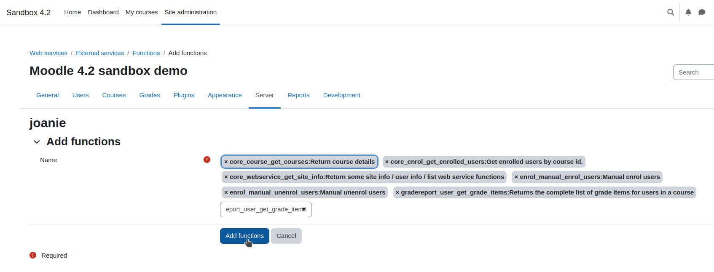

8. In the Moodle admin panel, go to `Site administration > Server > Web services > External services`.
    Click on the **Authorized users** in the **Joanie** line.

    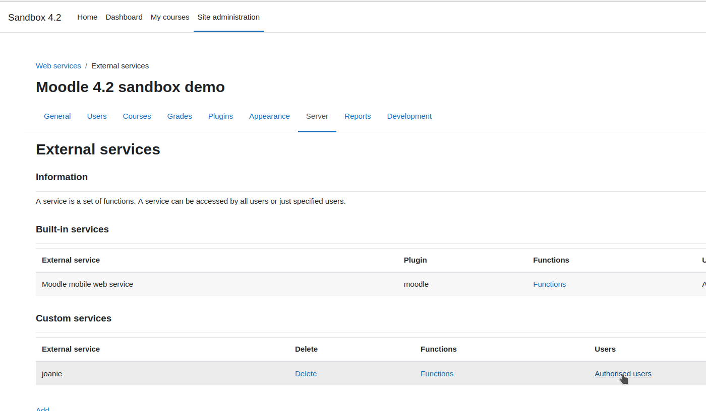

9. In the **Not authorized users ** list, select the **joanie** user, and click on the **Add** button.

    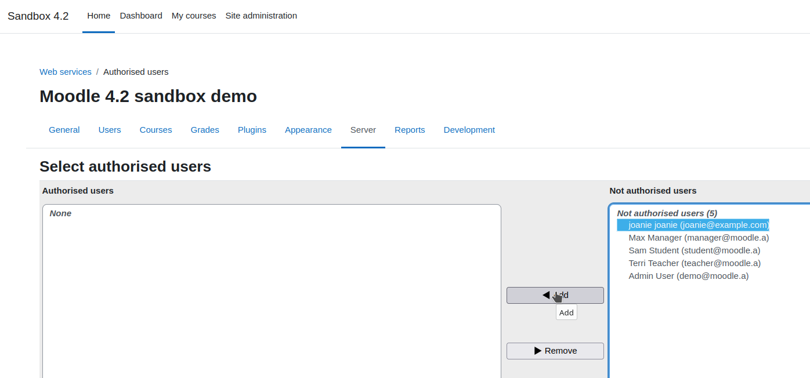

10. Install https://moodle.org/plugins/local_wsgetroles

11. Add local_wsgetroles_get_roles to Joanie webservice functions

## Setup Moodle settings in Joanie

### Declare a Moodle backend in JOANIE_LMS_BACKENDS environment variable

- MOODLE_API_TOKEN: the token of the Joanie user in Moodle
- MOODLE_BACKEND: use to override the Moodle backend module in Joanie
- MOODLE_BASE_URL: the URL of the Moodle webservice (e.g. `"http://moodle.test/webservice/rest/server.php"`)
- MOODLE_SELECTOR_REGEX: a regex to match the Moodle backend (e.g. `r"^.*/course/view.php\?id=.*$"`)
- MOODLE_COURSE_REGEX: a regex to match the Moodle course id (e.g. `r"^.*/course/view.php\?id=(.*)$"`)

```shell
JOANIE_LMS_BACKENDS = '[
    # ...
    {
       "API_TOKEN": "FakeApiKeyForExample",
       "BACKEND": "joanie.lms_handler.backends.moodle.MoodleLMSBackend",
       "BASE_URL": "http://moodle.test/webservice/rest/server.php",
       "SELECTOR_REGEX": "^.*/course/view.php\\?id=.*$",
       "COURSE_REGEX": "^.*/courses/(?P<course_id>.*)/course/?$"
    }
]'
```
