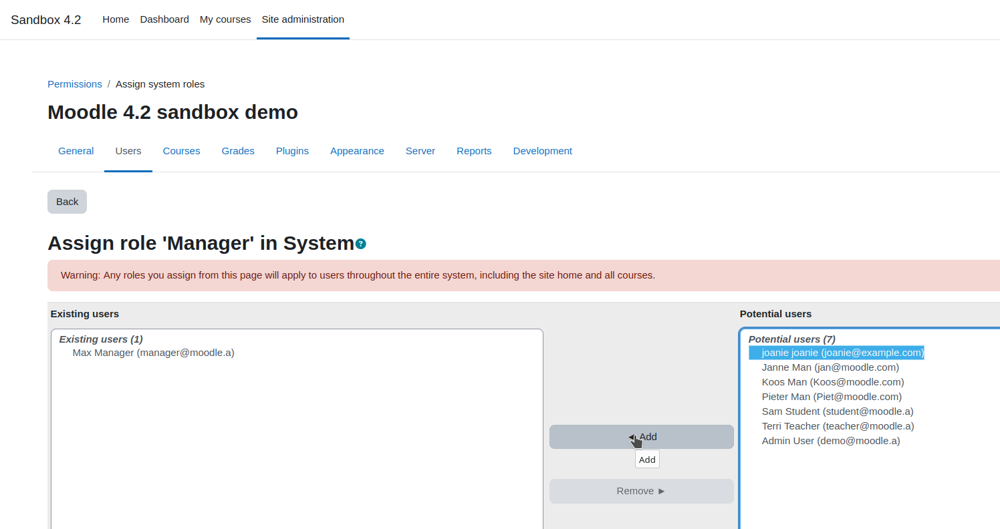

# Setup Moodle backend

In order to use Moodle as an LMS backend in Joanie,
we need to set up a Moodle webservice, and a Moodle webservice client.

## Setup Moodle webservice

### Create a Joanie user

1. In the Moodle admin panel, go to `Site administration > Users > Accounts > Add a new user`.

    

2. Fill the form with the following values:

   - Username: `joanie`
   - Password: `xxxxxxxx`
   - First name: `joanie`
   - Last name: `joanie`
   - Email address: `joanie@example.com`

   

3. Click on the **Create user** button.

### Assign manager role to Joanie user

1. In the Moodle admin panel, go to `Site administration > Users > Permissions > Assign system roles`.

    

2. Click on the existing **Manager** role.

    

3. In the **Potential users** list, select the **joanie** user, and click on the **Add** button.

    

### Create a Joanie webservice

[Detailed Moodle configuration documentation](https://docs.moodle.org/402/en/Using_web_services)


1. In the Moodle admin panel, go to `Site administration > Server > Web services > External services`.

    

2. Click on the **Add** button.
 
    

3. Fill the form with the following values:

   - Name: `Joanie`
   - Shortname: `joanie`
   - Enabled: `checked`
   - Authorized users only: `checked`

    

4. Click on the **Add service** button.

5. Click on the **Add functions** button.

    

6. For each function below, search for it in the dropdown select, and click it.

   - core_course_get_courses
   - core_enrol_get_enrolled_users
   - core_webservice_get_site_info
   - enrol_manual_enrol_users
   - enrol_manual_unenrol_users
   - gradereport_user_get_grade_items

7. Click on the **Add functions** button.

    

8. In the Moodle admin panel, go to `Site administration > Server > Web services > External services`.
    Click on the **Authorized users** in the **Joanie** line.

    

9. In the **Not authorized users ** list, select the **joanie** user, and click on the **Add** button.

    

## Setup Moodle webservice client

A python library exists to interact with Moodle webservices: [moodlepy](https://github.com/hexatester/moodlepy).

### Install moodlepy

```bash
pip install moodlepy
```

### Set moodle as an LMS backend in Joanie

_**TODO**_
