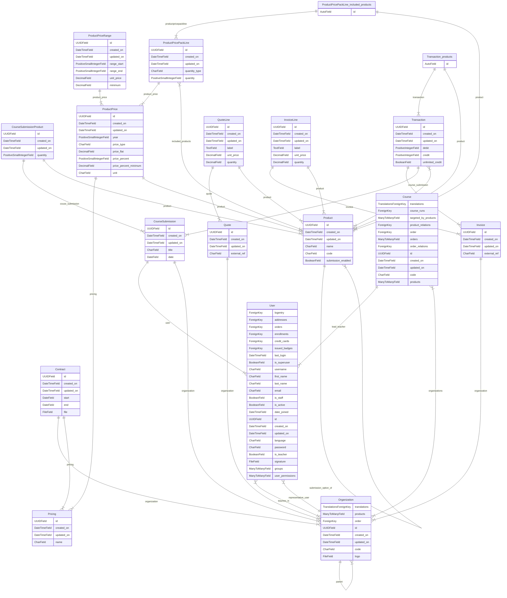

# Models

Here are described some important relations in our models.

## Relations 

```mermaid
erDiagram

CourseSubmission{

UUIDField id

DateTimeField created_on

DateTimeField updated_on

CharField title

DateField date

}

CourseSubmissionProduct{

UUIDField id

DateTimeField created_on

DateTimeField updated_on

PositiveSmallIntegerField quantity

}

Pricing{

UUIDField id

DateTimeField created_on

DateTimeField updated_on

CharField name

}

Product{

UUIDField id

DateTimeField created_on

DateTimeField updated_on

CharField name

CharField code

BooleanField submission_enabled

}

ProductPrice{

UUIDField id

DateTimeField created_on

DateTimeField updated_on

PositiveSmallIntegerField year

CharField price_type

DecimalField price_flat

PositiveSmallIntegerField price_percent

DecimalField price_percent_minimum

CharField unit

}

ProductPriceRange{

UUIDField id

DateTimeField created_on

DateTimeField updated_on

PositiveSmallIntegerField range_start

PositiveSmallIntegerField range_end

DecimalField unit_price

DecimalField minimum

}

ProductPricePackLine_included_products{

AutoField id

}

ProductPricePackLine{

UUIDField id

DateTimeField created_on

DateTimeField updated_on

CharField quantity_type

PositiveSmallIntegerField quantity

}

Contract{

UUIDField id

DateTimeField created_on

DateTimeField updated_on

DateField start

DateField end

FileField file

}

Transaction_products{

AutoField id

}

Transaction{

UUIDField id

DateTimeField created_on

DateTimeField updated_on

PositiveIntegerField debit

PositiveIntegerField credit

BooleanField unlimited_credit

}

Quote{

UUIDField id

DateTimeField created_on

DateTimeField updated_on

CharField external_ref

}

QuoteLine{

UUIDField id

DateTimeField created_on

DateTimeField updated_on

TextField label

DecimalField unit_price

DecimalField quantity

}

Invoice{

UUIDField id

DateTimeField created_on

DateTimeField updated_on

CharField external_ref

}

InvoiceLine{

UUIDField id

DateTimeField created_on

DateTimeField updated_on

TextField label

DecimalField unit_price

DecimalField quantity

}

User{

ForeignKey logentry

ForeignKey addresses

ForeignKey orders

ForeignKey enrollments

ForeignKey credit_cards

ForeignKey issued_badges

DateTimeField last_login

BooleanField is_superuser

CharField username

CharField first_name

CharField last_name

CharField email

BooleanField is_staff

BooleanField is_active

DateTimeField date_joined

UUIDField id

DateTimeField created_on

DateTimeField updated_on

CharField language

CharField password

BooleanField is_teacher

FileField signature

ManyToManyField groups

ManyToManyField user_permissions

}

Organization{

TranslationsForeignKey translations

ManyToManyField products

ForeignKey order

UUIDField id

DateTimeField created_on

DateTimeField updated_on

CharField code

FileField logo

}

Course{

TranslationsForeignKey translations

ForeignKey course_runs

ManyToManyField targeted_by_products

ForeignKey product_relations

ForeignKey order

ManyToManyField orders

ForeignKey order_relations

UUIDField id

DateTimeField created_on

DateTimeField updated_on

CharField code

ManyToManyField products

}

CourseSubmission||--|{User : user

CourseSubmission||--|{Organization : organization

CourseSubmissionProduct||--|{CourseSubmission : couse_submission

CourseSubmissionProduct||--|{Product : product

Product||--|{Product : submission_option_of

ProductPrice||--|{Pricing : pricing

ProductPrice||--|{Product : product

ProductPriceRange||--|{ProductPrice : product_price

ProductPricePackLine_included_products||--|{ProductPricePackLine : productpricepackline

ProductPricePackLine_included_products||--|{Product : product

ProductPricePackLine||--|{ProductPrice : product_price

ProductPricePackLine}|--|{Product : included_products

Contract||--|{Organization : organization

Contract||--|{Pricing : pricing

Transaction_products||--|{Transaction : transaction

Transaction_products||--|{Product : product

Transaction||--|{Invoice : invoice

Transaction||--|{CourseSubmission : course_submission

Transaction}|--|{Product : products

Quote||--|{Organization : organization

QuoteLine||--|{Quote : quote

QuoteLine||--|{Product : product

Invoice||--|{Organization : organization

InvoiceLine||--|{Invoice : invoice

InvoiceLine||--|{Product : product

User}|--|{Organization : teaches_in

Organization||--|{User : representative_user

Organization||--|{Organization : parent

Course||--|{User : lead_teacher

Course}|--|{Organization : organizations
```
