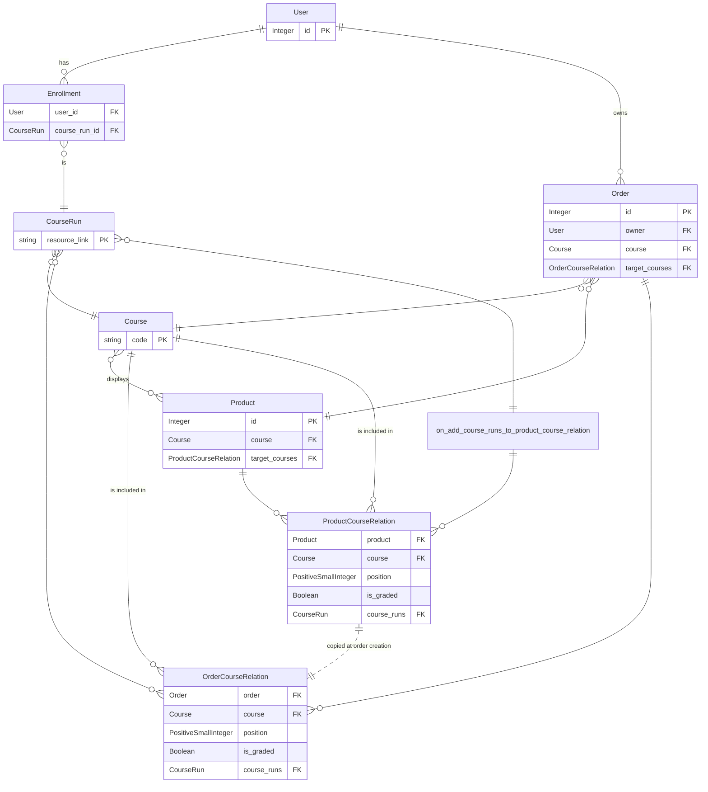
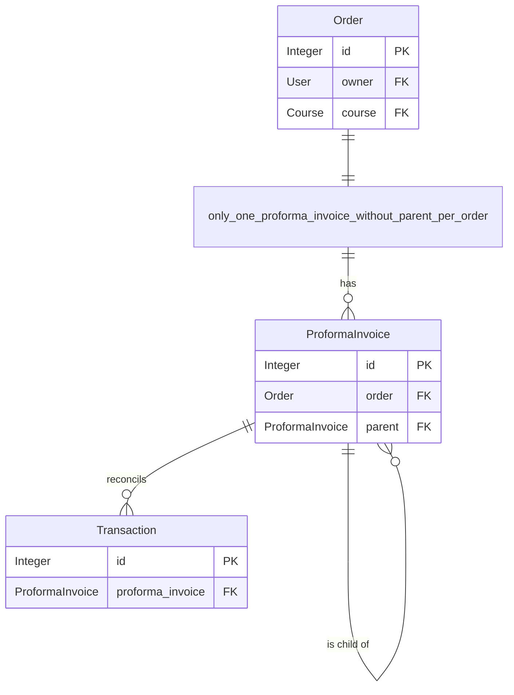

# Models

Here are described some important relations between our models.
You can also take a look at [core models](https://github.com/openfun/joanie/tree/main/src/backend/joanie/core/models)
and [payment models](https://github.com/openfun/joanie/tree/main/src/backend/joanie/payment/models.py).

## Relations between `Order` / `Product` / `Course` / `Course Run` and `Enrollment` models

### Focus

#### `course` and `target_courses` fields of `Product` and `Order` models

The `course` field represents the course under which the product is sold. Each order generated when
this product is sold will also be related to it. On the other hand, the `target_courses` field
represents the courses that the students will be able to follow once they buy the product.

#### The `ProductCourseRelation` and `OrderCourseRelation` models

First the `ProductCourseRelation` model is a join table between  a `Product` and a `Course`.

It has extra attributes :
- `position`: To order courses in the product
- `is_graded`: To take in account the grade of the course for the certificate delivery
- `course_runs`: To restrict the course to specific course runs. If this field is left blank, all 
  course runs related to linked course will be eligible for enrollment.

Then the `OrderCourseRelation` model is a join table between an `Order` and a `Course`.
This relation is created at the creation of an `Order` by copying the `CourseProductRelation`
of the related `Product`. In this way, a `Product` can be updated without impacting previously
created `Order`.

#### The signal `on_add_course_runs_to_product_course_relation`

It corresponds to a `m2m_changed` signal that is fired before a course run is added to a
product course relation. It is in charge of preventing the addition of a course run to a product
course relation if those two resources are not related to the same course.

## Relation between `Order` / `ProformaInvoice` and `Transaction` models

### Focus

#### Nesting of `ProformaInvoice`

The `ProformaInvoice` model has a field `parent` to be able to link pro forma invoices between them.
An `Order` should have only one pro forma invoice without parent which is the main invoice. If we
need to refund the client, pro forma invoices with a negative amount (a credit notes) are created
which are children of the main invoice.

#### Constraints on `ProformaInvoice` model

The `ProformaInvoice` model has two database constraints :

- A `UniqueConstraint` "only_one_proforma_invoice_without_parent_per_order" to prevent an order from 
having several main pro forma invoices.

- A `CheckConstraint` "main_proforma_invoice_should_have_a_positive_amount" to ensure that a
main pro forma invoice has a positive amount.

## Relation between `Order` / `Product` / `CertificateDefinition` and `Certificate` models

### Focus

#### `Product` / `CertificateDefinition` constraint

Only `Product` of type `CREDENTIAL` or `CERTIFICATE` can have a `CertificateDefinition`.
