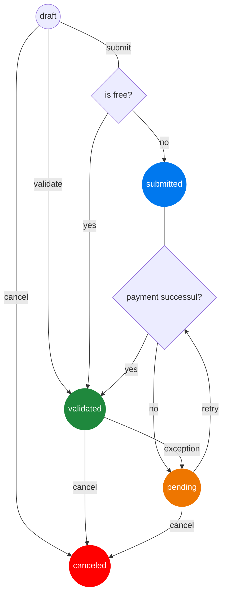

# Workflows

Here are described workflows inherent to some of our models

## Order

The Order model has a Finite State Machine (FSM) corresponding to the following schema

```mermaid
flowchart TD
    D((draft))
    F{is free?}
    V((validated))
    S((submitted))
    P((pending))
    T{payment successul?}
    C((canceled))

    D -->|cancel| C
    D ---|submit| F
    D -->|validate| V
    F -->|no| S
    F -->|yes| V
    S --- T
    T -->|yes| V
    T -->|no| P
    V -->|exception| P
    V -->|cancel| C
    P -->|retry| T
    P -->|cancel| C
    style V fill:#1f883d,stroke:#1f883d,color:#fff
    style C fill:#f00,stroke:#f00,color:#fff
    style P fill:#ee7600,stroke:#ee7600,color:#fff
    style S fill:#0078ee,stroke:#0078ee,color:#fff
```